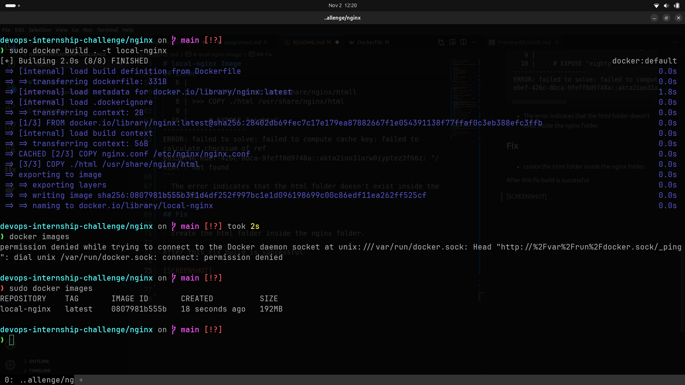
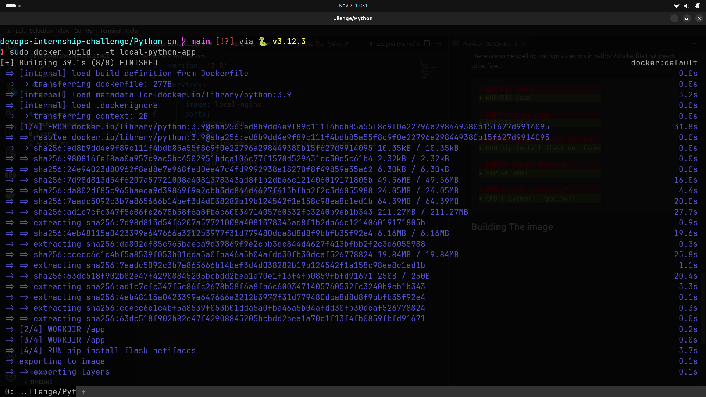
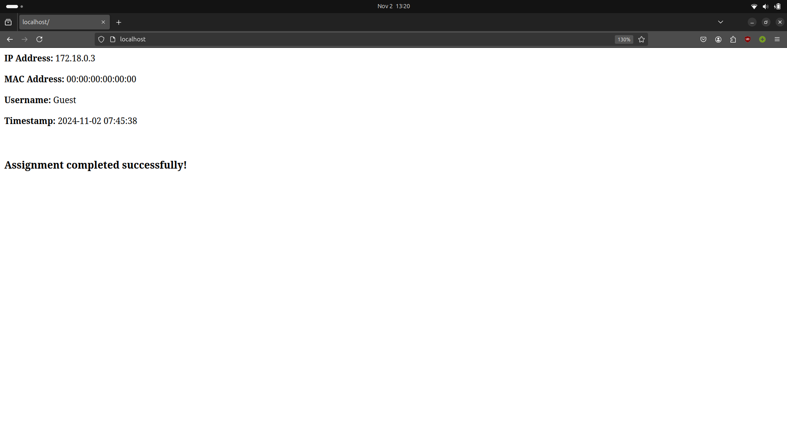
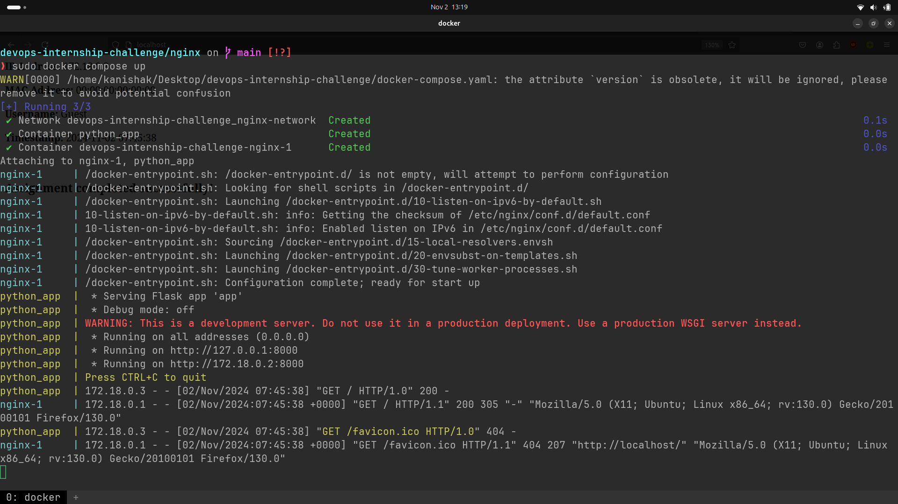

## Goals
- Set up Docker and Docker Compose.
- Build Docker images and launch containers.
- Debug and resolve intentional errors in the code to ensure the application runs correctly.

#### The Instructions to this assignment are found [HERE](assignment.md).

### The Report can be found [HERE](report.pdf).

## local-nginx
### Fixing Errors in Dockerfile

There are some spelling and syntax errors in nginx/Dockerfile that needs to be fixed.


``` diff
- FROM nginx:latests
+ FROM nginx:latest

- COPY nginix.conf /etc/nginx/nginx.conf
+ COPY nginx.conf /etc/nginx/nginx.conf

- COPY ./html /usr/share/nginx/htmll
+ COPY ./html /usr/share/nginx/html

- EXPOSE "eighty"
+ EXPOSE 80

- CMD ["nginx", "-g", "daemon of;"]
+ CMD ["nginx", "-g", "daemon off;"]
```

## Building The image

### Command
Run this command inside the nginx directory.

```sudo docker build . -t local-nginx```

### Error
The following Error occured while building the Image

```
devops-internship-challenge/nginx on  main [!?]
❯ sudo docker build . -t local-nginx
[+] Building 1.0s (7/7) FINISHED                                                                                                    docker:default
 => [internal] load build definition from Dockerfile                                                                                          0.0s
 => => transferring dockerfile: 331B                                                                                                          0.0s
 => [internal] load metadata for docker.io/library/nginx:latest                                                                               0.9s
 => [internal] load .dockerignore                                                                                                             0.0s
 => => transferring context: 2B                                                                                                               0.0s
 => CANCELED [1/3] FROM docker.io/library/nginx:latest@sha256:28402db69fec7c17e179ea87882667f1e054391138f77ffaf0c3eb388efc3ffb                0.0s
 => => resolve docker.io/library/nginx:latest@sha256:28402db69fec7c17e179ea87882667f1e054391138f77ffaf0c3eb388efc3ffb                         0.0s
 => => sha256:28402db69fec7c17e179ea87882667f1e054391138f77ffaf0c3eb388efc3ffb 10.27kB / 10.27kB                                              0.0s
 => [internal] load build context                                                                                                             0.0s
 => => transferring context: 32B                                                                                                              0.0s
 => CACHED [2/3] COPY nginx.conf /etc/nginx/nginx.conf                                                                                        0.0s
 => ERROR [3/3] COPY ./html /usr/share/nginx/html                                                                                             0.0s
------
 > [3/3] COPY ./html /usr/share/nginx/html:
------
Dockerfile:8
--------------------
   6 |
   7 |     # COPY ./html /usr/share/nginx/htmll
   8 | >>> COPY ./html /usr/share/nginx/html
   9 |
  10 |     # EXPOSE "eighty"
--------------------
ERROR: failed to solve: failed to compute cache key: failed to calculate checksum of ref eb356f46-ebef-426c-8bca-9feff0d9748a::akta2ioo31arw0iyptez3f66z: "/html": not found
```
- The error indicates that the html folder doesn't exist inside the nginx folder.

### Fix

create the html folder inside the nginx folder.


### After this fix,  build is successful


### SCREENSHOT


## some-python-app

### Fixing Errors in DockerFile
There are some spelling and syntax errors in python/Dockerfile that needs to be fixed.


```diff
FROM python:3.9

- WORKDIR /appp
+ WORKDIR /app

- COPY appy.py /app
+ COPY app.py /app

- RUN pip install flask netiface
+ RUN pip install flask netifaces

- EXPOSE "eight thousand"
+ EXPOSE 8000

- CMD ["pythn", "app.py"]
+ CMD ["python", "app.py"]
```

## Building The image

### Command
Run this command inside the python directory.

```sudo docker build . -t local-python-app ```

### SCREENSHOT





## docker-compose

### Fixing Errors in docker-compose.yaml

``` diff 
version: '3.8'

services:
  nginx:
    image: local-nginx
    ports:
-      - "eighty:80"
+      - "80:80"
    volumes:
-      - ./nginx/nginx.conf:/etc/nginx/nginx.confi
+      - ./nginx/nginx.conf:/etc/nginx/nginx.config
    networks:
      - nginx-network

  python-app:
    image: local-python-app
    container_name: python_app
    expose:
-      - "eight thousand"
+      - "8000"
    networks:
      - nginx-network

networks:
  nginx-network:
-    driver: bridg
+    driver: bridge
-    options:
-      compelex_option: value

```

## Running

### Command
Run this command in the base folder directory.

``` sudo docker compose up ```

### Error Logs

```
WARN[0000] /home/kanishak/Desktop/devops-internship-challenge/docker-compose.yaml: the attribute `version` is obsolete, it will be ignored, please remove it to avoid potential confusion
[+] Running 3/3
 ✔ Network devops-internship-challenge_nginx-network  Created                                                                                 0.1s
 ✔ Container python_app                               Created                                                                                 0.1s
 ✔ Container devops-internship-challenge-nginx-1      Created                                                                                 0.1s
Attaching to nginx-1, python_app
nginx-1     | /docker-entrypoint.sh: /docker-entrypoint.d/ is not empty, will attempt to perform configuration
nginx-1     | /docker-entrypoint.sh: Looking for shell scripts in /docker-entrypoint.d/
nginx-1     | /docker-entrypoint.sh: Launching /docker-entrypoint.d/10-listen-on-ipv6-by-default.sh
nginx-1     | 10-listen-on-ipv6-by-default.sh: info: Getting the checksum of /etc/nginx/conf.d/default.conf
nginx-1     | 10-listen-on-ipv6-by-default.sh: info: Enabled listen on IPv6 in /etc/nginx/conf.d/default.conf
nginx-1     | /docker-entrypoint.sh: Sourcing /docker-entrypoint.d/15-local-resolvers.envsh
nginx-1     | /docker-entrypoint.sh: Launching /docker-entrypoint.d/20-envsubst-on-templates.sh
nginx-1     | /docker-entrypoint.sh: Launching /docker-entrypoint.d/30-tune-worker-processes.sh
nginx-1     | /docker-entrypoint.sh: Configuration complete; ready for start up
nginx-1     | 2024/11/02 07:26:50 [emerg] 1#1: unknown directive "worker_process" in /etc/nginx/nginx.conf:3
nginx-1     | nginx: [emerg] unknown directive "worker_process" in /etc/nginx/nginx.conf:3
python_app  |  * Serving Flask app 'app'
python_app  |  * Debug mode: off
nginx-1 exited with code 1
python_app  | WARNING: This is a development server. Do not use it in a production deployment. Use a production WSGI server instead.
python_app  |  * Running on all addresses (0.0.0.0)
python_app  |  * Running on http://127.0.0.1:8000
python_app  |  * Running on http://172.18.0.2:8000
python_app  | Press CTRL+C to quit

```

### Errors

- The logs Indicate that there are some some errors in the nginx.conf file.

### Fixes

There are some spelling/syntax errors in the code.

```diff
- worker_process auto
+ worker_processes auto;

events {
-   worker_connection 1024;
+   worker_connections 1024;
}

http {
-   include       /etc/nginx/mime.typess;
+   include       /etc/nginx/mime.types;
-   default_typ application/octet-stream;
+   default_type application/octet-stream;

    server {
        listen 80;
        server_name localhost;

        location / {
            proxy_pass http://python_app:8000;
            proxy_set_header Host $host;
            proxy_set_header X-Real-IP $remote_addr;
            proxy_set_header X-Forwarded-For $proxy_add_x_forwarded_for;
            proxy_set_header X-Forwarded-Proto $scheme;
        }
    }
}

```
### After this fix , build the local-nginx image again and then run docker compose.


### Browser Window



### Nginx Logs



## Deployment

The following steps are followed in order to deloy this application on AWS.

- ### Starting ec2 server

    -  **Region** : Asia Pacific (Mumbai) ap-south-1
    -  **Instance** : t2.micro
    -  **Image** : Ubuntu
    -  **Storage** : 8 GB
    -  **Security Group** : Allow Inbound Access on **ports 80 ,443 , 22** from anywhere.


- ### Configuration of the server

    - update the list of available packages and their versions.
        ```
        sudo apt update
        ```
    - upgrade the server. 
        ```
        sudo apt upgrade
        ```
    - ### Installing Docker
        - Set up Docker's apt repository.
        
            ```
            # Add Docker's official GPG key:
            sudo apt-get update
            sudo apt-get install ca-certificates curl
            sudo install -m 0755 -d /etc/apt/keyrings
            sudo curl -fsSL https://download.docker.com/linux/ubuntu/gpg -o /etc/apt/keyrings/docker.asc
            sudo chmod a+r /etc/apt/keyrings/docker.asc

            # Add the repository to Apt sources:
            echo \
            "deb [arch=$(dpkg --print-architecture) signed-by=/etc/apt/keyrings/docker.asc] https://download.docker.com/linux/ubuntu \
            $(. /etc/os-release && echo "$VERSION_CODENAME") stable" | \
            sudo tee /etc/apt/sources.list.d/docker.list > /dev/null
            sudo apt-get update

            ```
        - Install the Docker packages.
            ```
            sudo apt-get install docker-ce docker-ce-cli containerd.io docker-buildx-plugin docker-compose-plugin
            ```
    
        - In case of any issue refer to the official [Documentation](https://docs.docker.com/engine/install/ubuntu/)

    

- ### Running the server

    - Clone this  Repository.

    - Build  docker images of both local-nginx and local-python-app.

    - start the docker compose in detachable mode.

        ```
        sudo docker compose up --detach
        ```

    - Now we can access the application on the public IP of the server.
    http://3.111.31.161/


### There are also other alternatives to deploy this application.

- Upload the Images to Docker Hub and then pull them on the server machine .

- create the CI/CD pipeline using Jenkins which can be configured to automatically build and deploy the code in production when there is a push request in a repository.

- By using Amazon  Elastic Container Service (ECS).

### DNS Records


    

